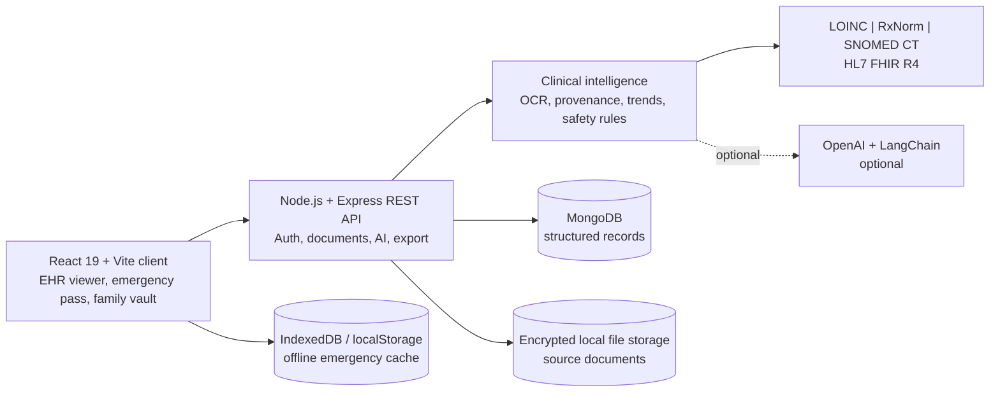
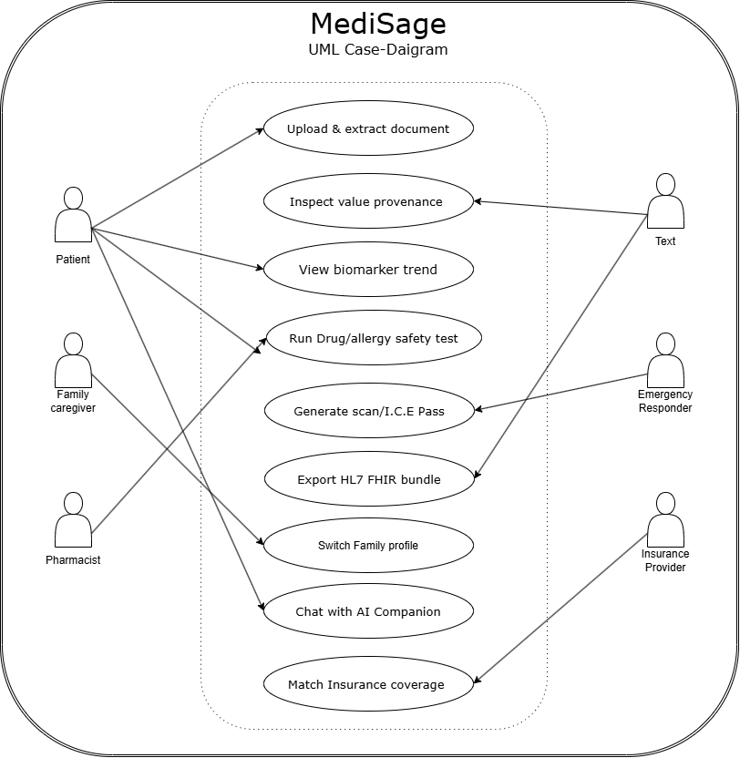

# MediSage

## Clinical Document Intelligence and Sovereign Health Vault

MediSage is a patient-controlled health-record platform that turns prescriptions, laboratory reports, radiology reports, and discharge summaries into a searchable longitudinal record. Every extracted clinical value is intended to remain traceable to its source document, while medication safety checks, offline emergency access, family profiles, and HL7 FHIR R4 export make the record useful beyond a single application.

> **Project status:** Current release scope: v2.0. This repository contains the project documentation and design artefacts. Confirm the implementation status of individual features before using the system with real patient data.

## Contents

- [Why MediSage](#why-medisage)
- [Core capabilities](#core-capabilities)
- [System architecture](#system-architecture)
- [UML use-case diagram](#uml-use-case-diagram)
- [Technology stack](#technology-stack)
- [Requirements and quality goals](#requirements-and-quality-goals)
- [Getting started](#getting-started)
- [Configuration](#configuration)
- [Expected workflows](#expected-workflows)
- [Project scope](#project-scope)
- [Team](#team)
- [Documentation sources](#documentation-sources)
- [Medical and safety disclaimer](#medical-and-safety-disclaimer)

## Why MediSage

Clinical information is often split between paper prescriptions, PDF lab reports, hospital portals, and discharge paperwork. This fragmentation makes it difficult for patients, caregivers, physicians, and emergency responders to reconstruct an accurate history.

MediSage addresses that problem with a single, verifiable vault that can:

- consolidate clinical documents and extracted entities;
- show where each value came from on the original document;
- display biomarker history and trends over time;
- identify medication and allergy safety risks;
- provide a QR-enabled emergency pass that works in degraded or offline mode;
- export structured records in HL7 FHIR R4 format; and
- manage separate records for family members and dependents.

## Core capabilities

| Capability | Description |
| --- | --- |
| Document ingestion | Accepts PDF, JPEG, PNG, JSON, and HL7 clinical artefacts, subject to the configured upload limit. |
| OCR and entity extraction | Identifies document types, biomarkers, medications, and other clinical entities. The target precision for laboratory biomarkers is greater than 98.5% on suitable source documents. |
| Pixel provenance | Associates extracted values with source-document coordinates and a provenance hash so users can inspect the evidence. |
| Biomarker trends | Displays historical values, deltas, and status indicators such as optimal, borderline, or elevated. |
| Safety guard | Checks drug-drug interactions, allergy cross-reactivity, CYP450 pathways, and selected renal or haemodynamic risks. |
| Emergency I.C.E. Pass | Presents essential information such as blood group, allergies, medications, and emergency contacts through a QR-accessible, offline-capable view. |
| FHIR export | Produces an HL7 FHIR R4 bundle containing resources such as `Patient`, `Observation`, `MedicationStatement`, and `AllergyIntolerance`. |
| Family vault | Lets an account switch between distinct patient and dependent profiles without mixing their records. |
| AI companion | Provides evidence-based summaries and conversational assistance, with a rule-based fallback when an OpenAI key is unavailable. |
| Insurance matcher | Compares coverage options with chronic conditions, medication costs, waiting periods, and preventive-care benefits. |

## System architecture



### Data and trust principles

1. Source files are retained separately from structured clinical data.
2. Extracted values should include their source location and confidence information.
3. User records must remain isolated by user or dependent profile.
4. The intelligence layer must fall back to deterministic or heuristic behavior when optional services are unavailable.
5. Offline caching should contain only the minimum data needed for degraded operation and emergency access.

## UML use-case diagram

The diagram below captures the primary actors and user-facing use cases defined during requirements elicitation.



### Actors and main use cases

| Actor | Main interactions |
| --- | --- |
| Patient | Upload and extract documents, inspect provenance, view biomarker trends, run safety checks, generate an I.C.E. pass, export FHIR, and chat with the AI companion. |
| Family caregiver | Switch family profiles and manage dependent records. |
| Pharmacist | Review medication and allergy safety results. |
| Emergency responder | Access the emergency pass and its triage information. |
| Physician or clinical reviewer | Inspect source-linked values and receive interoperable records. |
| Insurance provider | Use the insurance coverage-matching output. |

## Technology stack

| Layer | Technologies |
| --- | --- |
| Frontend | React 19, Vite 6, React Router v7, Tailwind CSS v4, GSAP, Lucide React, Axios |
| Backend | Node.js 18 or 20, Express 4.18, Mongoose 7.8, Multer |
| Authentication | JWT sessions and bcrypt password hashing |
| Data | MongoDB for structured records; encrypted local storage for uploaded files |
| AI and rules | LangChain and OpenAI when configured; rule-based heuristic fallback otherwise |
| Clinical standards | LOINC, RxNorm, SNOMED CT, HL7 FHIR R4 / US Core |
| Offline support | Browser IndexedDB or localStorage for minimum emergency/degraded-mode data |

## Requirements and quality goals

The authoritative requirements are maintained in the SRS and elicitation document. The implementation is expected to meet these high-level goals:

- **Traceability:** no extracted clinical value should be presented without a link to its source location.
- **Safety:** medication and allergy warnings must explain the detected mechanism or conflict clearly.
- **Availability:** the emergency pass must remain usable without a live network connection.
- **Interoperability:** FHIR exports must be well-formed HL7 FHIR R4 bundles.
- **Security:** use JWT authentication, bcrypt password hashing, per-user data isolation, HTTPS in deployment, server-side file sanitization, and a 25 MB individual upload limit.
- **Usability:** support modern desktop and mobile browsers and provide distinct views for the EHR timeline, provenance inspector, safety guard, emergency pass, FHIR exporter, and family profiles.

## Getting started

The expected development workflow is:

```bash
npm install
npm run dev
```

The documented development setup starts the backend and frontend concurrently. The expected default ports are:

- Frontend: `http://localhost:3000`
- Backend: `http://localhost:5000`

If the repository scripts differ from these expectations, treat `package.json` as the source of truth.

### API smoke test

When available in the repository, run the API regression script after starting the application:

```bash
node test-api.js
```

The smoke-test coverage is expected to include health checks, registration, login, profile retrieval, document upload and extraction, AI analysis, insurance matching, and chat.

## Configuration

Create a `.env` file at the project root. Do not commit secrets.

```dotenv
PORT=5000
MONGODB_URI=mongodb://127.0.0.1:27017/medisage
JWT_SECRET=replace-with-a-long-random-secret
OPENAI_API_KEY=
NODE_ENV=development
```

`OPENAI_API_KEY` is optional for heuristic-mode development. Use a production-grade secret manager and HTTPS when deploying. Never use real patient data in a development environment unless the deployment has been reviewed and secured for that purpose.

## Expected workflows

### Upload and verify a document

1. Authenticate and select the intended patient profile.
2. Upload a supported clinical document.
3. Review extracted biomarkers, medications, confidence scores, and document classification.
4. Select an extracted value to inspect its highlighted source location.
5. Confirm or correct the record before relying on it in another workflow.

### Check medication safety

Run the safety guard against active medications and recorded allergies. Review the interaction mechanism and consult a qualified clinician before changing medication.

### Prepare emergency access

Keep blood group, allergies, conditions, medications, and emergency contact information current. Generate the QR pass and verify that the cached emergency view remains available without connectivity.

### Export a hospital passport

Export the selected patient profile as an HL7 FHIR R4 bundle and validate the output before importing it into another clinical system.

## Project scope

### Current release: v2.0

- Pixel-level provenance viewer
- Drug-drug and drug-allergy safety guard
- Universal offline-capable I.C.E. pass and printable wallet card
- HL7 FHIR R4 export
- Family and dependent profile switching
- OCR and entity extraction
- Biomarker trend engine
- AI health synthesis and conversational companion
- Insurance coverage matcher

### Future roadmap

- v2.1: Native DICOM 3D WebGL viewer
- v2.2: End-to-end encrypted WebRTC telehealth consultations
- v2.3: Apple HealthKit and Google Health Connect synchronisation
- v2.4: Multi-language emergency triage

Official diagnosis, prescribing authority, and emergency dispatch are outside the scope of MediSage.

## Team

| Name | Role | Responsibility |
| --- | --- | --- |
| Yash Singhal | Full-stack developer | Architecture, Node.js/Express backend, React frontend, and AI integration |
| Saurav Singh | Documentation lead | Project documentation |
| Sparsh Singhal | DevOps | Deployment |
| Saumya Singhal | Documentation co-lead | Project documentation |

## Documentation sources

- [MediSage requirements elicitation document](MediSage_Elicitation_Document.docx)
- [MediSage software requirements specification](MediSage_SRS_final.docx)
- [MediSage UML use-case diagram](UML_daigran-MediSage.png)

The SRS is the reference for functional, non-functional, interface, and other formal requirements. The elicitation document records stakeholder needs, personas, acceptance criteria, and key findings.

## Medical and safety disclaimer

MediSage is an informational clinical-document and personal-health-record system. AI summaries, biomarker interpretations, dietary suggestions, and medication alerts are not medical diagnoses or prescriptions. Always consult a qualified healthcare professional before making decisions about treatment. In a life-threatening emergency, contact local emergency services immediately.

MediSage must not be treated as a substitute for licensed medical care, clinical judgment, or emergency dispatch.
