# MediSage Low-Level Flow of Data (FOD)

## Purpose and scope

This document describes the low-level flow of data through MediSage, the
Clinical Document Intelligence and Sovereign Health Vault platform. It
decomposes the major capabilities from the system architecture into concrete
processes, data stores, external actors, and data flows.

The diagram is a top-down Level-2 view. It starts with the complete MediSage
system boundary, decomposes into external inputs and the client, then follows
the API and low-level clinical processes down to controlled data stores and
outputs. It focuses on what data enters the system, how it is authenticated,
validated, extracted, enriched, stored, displayed, exported, and cached for
emergency use. It does not prescribe deployment topology or implementation
classes.

## Low-level FOD diagram

The editable draw.io source is available here. The canvas is arranged as a
vertical tree that emphasizes the top-down FOD decomposition:
[MediSage system](#low-level-fod-diagram) → external inputs → client → REST
API → low-level clinical processes → controlled stores and outputs:
[FOD_LowLevel.drawio](FOD_LowLevel.drawio). Open it in
[diagrams.net](https://app.diagrams.net/) or the draw.io desktop application
to edit, export, or present the diagram. The Mermaid block below is a
portable preview of the same logical flow.

```mermaid
flowchart TD
    Patient[Patient or caregiver]
    Clinician[Physician, pharmacist, or reviewer]
    Responder[Emergency responder]
    Insurer[Insurance provider]
    Standards[LOINC, RxNorm, SNOMED CT]
    AIService[Optional OpenAI or LangChain service]

    subgraph Client["1. Client and access boundary"]
        UI[React client<br/>timeline, upload, safety, export]
        AuthUI[Login and profile selection]
        EmergencyUI[Offline emergency pass]
    end

    subgraph API["2. REST API and control processes"]
        Auth[2.1 Authenticate and authorize]
        Profile[2.2 Resolve active patient profile]
        Upload[2.3 Validate and receive document]
        ReadAPI[2.4 Read timeline and source evidence]
        SafetyAPI[2.5 Request medication safety check]
        ExportAPI[2.6 Request FHIR export]
        ChatAPI[2.7 Process assistant or insurance request]
    end

    subgraph Intelligence["3. Clinical intelligence processes"]
        Classify[3.1 Classify document]
        Extract[3.2 OCR and extract entities]
        Provenance[3.3 Attach confidence and source coordinates]
        Trends[3.4 Calculate biomarker trends]
        Safety[3.5 Evaluate interactions and allergies]
        Synthesis[3.6 Build evidence-linked summary]
        Match[3.7 Match plan to conditions and costs]
        FHIR[3.8 Map records to FHIR R4]
    end

    subgraph Stores["4. Controlled data stores"]
        UserDB[(User and session records)]
        ClinicalDB[(Clinical records<br/>profiles, observations, medicines)]
        DocumentDB[(Encrypted source documents)]
        AuditDB[(Audit and provenance records)]
        OfflineDB[(IndexedDB or localStorage<br/>minimum emergency data)]
    end

    Patient -->|credentials and profile choice| AuthUI
    Clinician -->|authenticated review request| UI
    Responder -->|scan or open emergency pass| EmergencyUI
    Insurer -->|coverage criteria| UI
    AuthUI -->|credentials, token request| Auth
    Auth -->|session token and claims| UserDB
    Auth -->|authorized session| Profile
    Profile -->|active profile ID| UI

    Patient -->|PDF, image, JSON, or HL7 file| UI
    UI -->|multipart upload and profile ID| Upload
    Upload -->|size, type, and malware checks| DocumentDB
    Upload -->|document ID and processing job| Classify
    Classify -->|document type and pages| Extract
    Extract -->|raw text and candidate entities| Provenance
    DocumentDB -->|source pixels and metadata| Provenance
    Provenance -->|values, coordinates, confidence, hash| ClinicalDB
    Provenance -->|source link and processing event| AuditDB
    ClinicalDB -->|observations and dates| Trends
    Trends -->|status and historical deltas| ClinicalDB
    Standards -->|codes and terminology mappings| Extract
    Standards -->|standard codes| FHIR

    UI -->|timeline or evidence query| ReadAPI
    ReadAPI -->|profile-scoped query| ClinicalDB
    ReadAPI -->|document ID and source region| DocumentDB
    ClinicalDB -->|records, trends, provenance links| ReadAPI
    DocumentDB -->|source document or page| ReadAPI
    ReadAPI -->|traceable timeline and evidence| UI

    UI -->|medicine, allergies, and profile ID| SafetyAPI
    SafetyAPI -->|medications, allergies, conditions| ClinicalDB
    SafetyAPI -->|risk evaluation request| Safety
    Safety -->|rules and terminology| Standards
    Safety -->|alerts and explanations| ClinicalDB
    SafetyAPI -->|profile-scoped alerts| UI

    UI -->|export request and profile ID| ExportAPI
    ExportAPI -->|verified clinical records| ClinicalDB
    ExportAPI -->|FHIR mapping request| FHIR
    FHIR -->|FHIR R4 bundle| ExportAPI
    ExportAPI -->|validated export| Clinician

    UI -->|question, evidence scope, or plan criteria| ChatAPI
    ChatAPI -->|clinical context| ClinicalDB
    ChatAPI -->|evidence references| AuditDB
    ChatAPI -->|optional prompt| AIService
    AIService -.->|summary or answer| Synthesis
    ChatAPI -->|deterministic fallback request| Synthesis
    Synthesis -->|evidence-linked answer| ChatAPI
    ChatAPI -->|assistant response| UI
    ChatAPI -->|coverage matching request| Match
    Match -->|plan and condition comparison| Insurer
    Match -->|ranked coverage result| ChatAPI

    Profile -->|minimum emergency fields| OfflineDB
    ClinicalDB -->|allergies, medicines, blood group, contacts| OfflineDB
    OfflineDB -->|encrypted local emergency data| EmergencyUI
    EmergencyUI -->|essential information| Responder
    UI -->|cache refresh or revoke| OfflineDB

    Auth -.->|access event| AuditDB
    ReadAPI -.->|read event| AuditDB
    SafetyAPI -.->|safety-check event| AuditDB
    ExportAPI -.->|export event| AuditDB

    classDef actor fill:#fff3d6,stroke:#b77d15,color:#5d430e;
    classDef client fill:#dcecf7,stroke:#2f6690,color:#17324d;
    classDef api fill:#e6f4ec,stroke:#4c956c,color:#183b29;
    classDef process fill:#f1e6f8,stroke:#805aa5,color:#3c2554;
    classDef store fill:#f9e5ea,stroke:#b84a62,color:#5b1e2d;
    classDef external fill:#e8f1f8,stroke:#17324d,color:#17324d;

    class Patient,Clinician,Responder,Insurer actor;
    class UI,AuthUI,EmergencyUI client;
    class Auth,Profile,Upload,ReadAPI,SafetyAPI,ExportAPI,ChatAPI api;
    class Classify,Extract,Provenance,Trends,Safety,Synthesis,Match,FHIR process;
    class UserDB,ClinicalDB,DocumentDB,AuditDB,OfflineDB store;
    class Standards,AIService external;
```

## Data-flow descriptions

| ID | Flow | Data transferred | Main control |
| --- | --- | --- | --- |
| F1 | Patient to authentication | Credentials and selected account | Password hashing, token issuance, session expiry |
| F2 | Client to document ingestion | File, MIME type, size, active profile ID | Allow-list formats, 25 MB limit, sanitization |
| F3 | Document to extraction | Source pages, OCR text, candidate entities | Classification, OCR, parser validation |
| F4 | Extraction to clinical record | Biomarkers, medicines, allergies, dates, units | Confidence score, profile isolation, provenance |
| F5 | Clinical record to timeline | Observations, trends, source links | Authorized read and traceable evidence |
| F6 | Clinical record to safety guard | Medicines, allergies, conditions | Drug interaction, cross-reactivity, renal and haemodynamic rules |
| F7 | Clinical record to FHIR export | Patient and clinical resources | HL7 FHIR R4 mapping and validation |
| F8 | Clinical context to assistant | Question, permitted context, evidence references | Optional AI; deterministic fallback when unavailable |
| F9 | Clinical record to offline cache | Minimum emergency fields | Encrypted cache, least data, refresh and revoke |
| F10 | System to audit store | Access, extraction, safety, and export events | Timestamp, actor, profile, and operation |

## Trust boundaries and invariants

1. The client is untrusted input. The API re-checks authentication,
   authorization, file type, file size, and active profile ownership.
2. Source documents and structured clinical records are stored separately.
   Every extracted clinical value must retain a source document reference,
   location, confidence, and provenance hash, or be explicitly marked
   unverified.
3. Profile ID is carried through every read, write, extraction, safety, cache,
   and export operation. A user must not be able to query another profile by
   changing an ID in the request.
4. The offline store contains only the minimum emergency information. It must
   support refresh and revocation and must not become a second full clinical
   database.
5. Safety alerts and assistant responses are informational. They must expose
   their evidence or rule basis and must not be presented as a diagnosis or
   prescription.
6. Optional AI is outside the required safety path. If it is unavailable, the
   deterministic safety rules and rule-based assistant fallback remain usable.

## Mapping to implementation layers

| FOD area | MediSage implementation |
| --- | --- |
| Client and cache | React 19, Vite, IndexedDB or localStorage |
| API and access boundary | Node.js, Express REST API, JWT sessions |
| Clinical intelligence | OCR, entity extraction, provenance, trend and safety services |
| Structured data | MongoDB and Mongoose models |
| Source data | Encrypted local file storage |
| Interoperability | HL7 FHIR R4 with LOINC, RxNorm, and SNOMED CT |
| Optional intelligence | OpenAI and LangChain with deterministic fallback |
