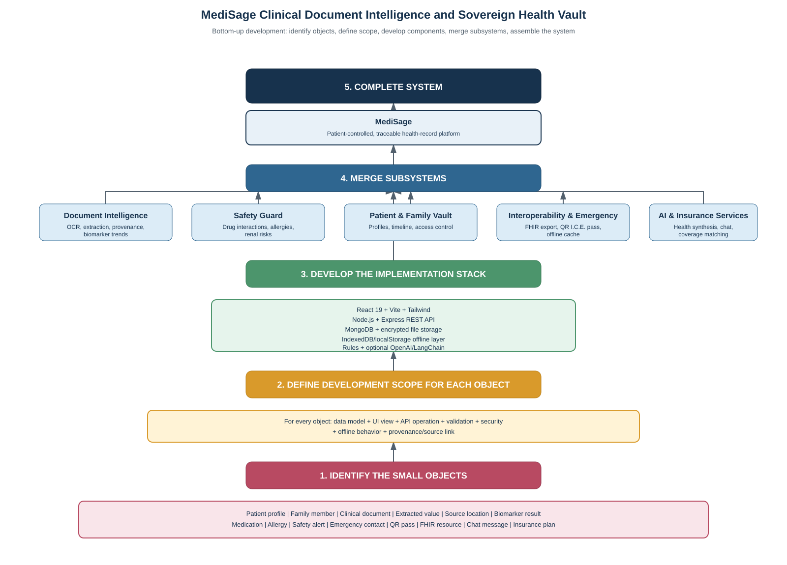

# MediSage Bottom-Up Development Approach

## 1. Purpose

The bottom-up approach builds MediSage from small, understandable objects toward a complete clinical document intelligence and sovereign health vault system. Each object is first identified, its development scope is defined, and its behavior is implemented and tested. Related objects are then combined into subsystems. Finally, the subsystems are integrated into the complete MediSage platform.

This approach is useful for MediSage because the platform handles sensitive clinical data, extracted values, source-document evidence, medication safety, offline access, and interoperability. Building from small units makes it easier to control data ownership, validate clinical behavior, and preserve traceability.

## Bottom-Up Diagram

The following diagram shows how MediSage grows from small domain objects into the complete system. The editable draw.io version is available in [BottomUp.drawio](BottomUp.drawio).



## 2. Step One: Identify the Small Objects

The first step is to list the smallest meaningful objects in the domain. An object represents a person, document, clinical value, action, or external record that the system must store or process.

### MediSage objects

| Object | Responsibility |
| --- | --- |
| Patient profile | Stores identity, demographics, and the selected health record. |
| Family member | Represents a dependent or another profile managed by the account holder. |
| Clinical document | Represents a prescription, laboratory report, radiology report, discharge summary, image, PDF, JSON file, or HL7 artefact. |
| Extracted value | Stores a value detected by OCR or structured parsing, such as a medicine or biomarker. |
| Source location | Stores the page, coordinates, or document region where an extracted value was found. |
| Provenance record | Stores confidence, extraction metadata, and a hash linking the value to its source evidence. |
| Biomarker result | Stores a laboratory measurement, unit, reference range, date, and status. |
| Medication | Stores a medicine, dosage, schedule, and active or historical state. |
| Allergy | Stores an allergy, reaction, severity, and related safety information. |
| Safety alert | Stores a drug-drug, drug-allergy, renal, haemodynamic, or other detected risk. |
| Emergency contact | Stores a trusted contact used during emergency access. |
| QR emergency pass | Provides minimum essential information for degraded or offline access. |
| FHIR resource | Represents interoperable data such as Patient, Observation, MedicationStatement, or AllergyIntolerance. |
| Chat message | Represents a question, answer, evidence reference, or rule-based fallback response. |
| Insurance plan | Stores coverage information used for cost and condition matching. |

At this stage, the team should avoid building the entire application. The goal is to understand what each object means, what information it owns, and how it relates to other objects.

## 3. Step Two: Define Development Scope for Each Object

After identifying an object, define its complete development scope. Every object should have a clear data contract and a clear place in the user workflow.

For each object, specify:

1. **Data model:** fields, types, required values, identifiers, timestamps, and relationships.
2. **User interface:** the screen, card, table, form, or inspector that displays or edits the object.
3. **API operation:** endpoints for creating, reading, updating, deleting, extracting, exporting, or checking the object.
4. **Validation:** required fields, supported formats, numeric limits, clinical units, and invalid-state behavior.
5. **Security:** authentication, authorization, profile isolation, file sanitization, and protection of sensitive data.
6. **Traceability:** the source document, page, coordinates, confidence, and provenance hash for extracted clinical values.
7. **Offline behavior:** whether the object can be cached, what minimum fields are needed, and how stale data is handled.
8. **Failure behavior:** deterministic fallback behavior when OCR, AI, a database, or an external service is unavailable.
9. **Testing:** unit tests, API tests, UI tests, and representative clinical-document examples.

For example, the `Biomarker result` object needs a numeric value, unit, reference range, date, status, source document, source location, and confidence score. It should be visible in the biomarker trend view, retrievable through the API, validated against its expected format, and traceable back to the original report. It should not be presented as verified if extraction confidence or source evidence is missing.

## 4. Step Three: Stick to Development

Once the scope is agreed, develop each object according to its defined contract. The implementation should stay focused on the selected object and should not silently expand into unrelated features.

A practical development sequence is:

1. Define the object schema and identifiers.
2. Implement the smallest backend model or domain function.
3. Implement validation and security checks.
4. Add the API operation or processing service.
5. Build the corresponding frontend view or form.
6. Add source links, confidence, and error states where the object contains extracted clinical data.
7. Add unit and integration tests.
8. Test normal, invalid, empty, offline, and service-unavailable cases.
9. Review the object against the agreed development scope before moving on.

For MediSage, development must also follow these rules:

- Never mix records from different patient or dependent profiles.
- Never show an extracted clinical value without its source evidence or an explicit unverified state.
- Keep optional AI services separate from deterministic safety and extraction fallbacks.
- Cache only the minimum data required for emergency access.
- Treat medication alerts and AI summaries as informational support, not diagnosis or prescribing authority.
- Use standards such as LOINC, RxNorm, SNOMED CT, and HL7 FHIR R4 when mapping clinical data.

“Stick to develop” therefore means staying faithful to the defined object scope, completing the object thoroughly, and resisting premature integration before its behavior is testable.

## 5. Step Four: Merge the Subsystems

After individual objects are implemented and tested, combine related objects into focused subsystems. A subsystem is a coherent group of objects that delivers one major capability.

### MediSage subsystems

#### Document Intelligence

Combines clinical documents, extracted values, source locations, provenance records, and biomarker results. It handles upload, OCR, classification, entity extraction, confidence scoring, source highlighting, and historical trends.

#### Safety Guard

Combines medications, allergies, patient conditions, and safety alerts. It checks drug-drug interactions, drug-allergy cross-reactivity, CYP450 pathways, and selected renal or haemodynamic risks. Each warning should explain the detected conflict and should not be treated as a prescription.

#### Patient and Family Vault

Combines patient profiles, family members, authentication, authorization, timelines, and record switching. Its central responsibility is keeping each profile isolated so that one person's documents and clinical values cannot appear in another person's record.

#### Interoperability and Emergency Access

Combines emergency contacts, the QR emergency pass, offline cache, FHIR resources, and export validation. It provides minimum essential information during degraded connectivity and produces an HL7 FHIR R4 bundle for transfer to another clinical system.

#### AI and Insurance Services

Combines chat messages, evidence references, health synthesis, insurance plans, chronic conditions, medication costs, waiting periods, and preventive-care benefits. OpenAI and LangChain may enhance this subsystem, but deterministic or heuristic fallback behavior must remain available when optional services are not configured.

Merging means defining the contracts between these subsystems. For example, Document Intelligence supplies source-linked medications and allergies to Safety Guard; Patient and Family Vault supplies the selected profile; Interoperability consumes verified profile data for FHIR export and emergency access.

## 6. Step Five: Assemble the Complete MediSage System

The final system is produced when the subsystems operate together through the React client, Node.js and Express API, clinical intelligence services, MongoDB, encrypted file storage, and offline browser storage.

The complete platform should support this flow:

1. A user authenticates and selects the intended patient profile.
2. The user uploads a clinical document.
3. The intelligence subsystem extracts entities and preserves their source evidence.
4. The record is displayed in the longitudinal timeline and biomarker views.
5. The safety subsystem checks medications and allergies.
6. The user can generate an offline-capable emergency pass.
7. The user can export the selected record as an HL7 FHIR R4 bundle.
8. The AI companion and insurance matcher use the selected profile and available evidence.
9. The user can manage family profiles without mixing their data.

The final system is complete only when these integrations preserve the original object-level guarantees: traceability, profile isolation, safety explanations, offline minimum-data rules, security, and interoperability.

## 7. Recommended Build Order

```text
Small objects
    -> object schemas and validation
    -> object-level UI and API behavior
    -> tested implementation units
    -> Document Intelligence, Safety, Vault, Emergency/FHIR, AI/Insurance subsystems
    -> integrated MediSage platform
```

A suitable implementation order is:

1. Patient profile, family member, authentication, and access control.
2. Clinical document, file validation, storage, and document metadata.
3. Extracted value, source location, provenance, and confidence.
4. Biomarker result and longitudinal trend data.
5. Medication, allergy, and safety alert.
6. Emergency contact, QR pass, and offline cache.
7. FHIR resource and export bundle.
8. Chat message, AI fallback, and insurance plan matching.
9. Cross-subsystem integration, end-to-end testing, and security review.

## 8. Quality Checks Before Completion

Before considering MediSage ready for real workflows, verify that:

- Every extracted value can be traced to a source document location.
- Patient and dependent profiles remain isolated.
- Medication and allergy alerts explain the reason for each warning.
- Emergency information works from the permitted offline cache.
- FHIR exports are valid HL7 FHIR R4 bundles.
- Uploads obey the configured 25 MB limit and are safely sanitized.
- AI-dependent features have a deterministic fallback.
- Desktop and mobile views support the main workflows.
- Tests cover valid, invalid, missing, offline, and unavailable-service conditions.
- The product disclaimer is visible wherever clinical interpretation or medication safety information is presented.

MediSage is an informational clinical-document and personal-health-record system. It does not replace licensed medical care, clinical judgment, prescribing authority, or emergency services.
